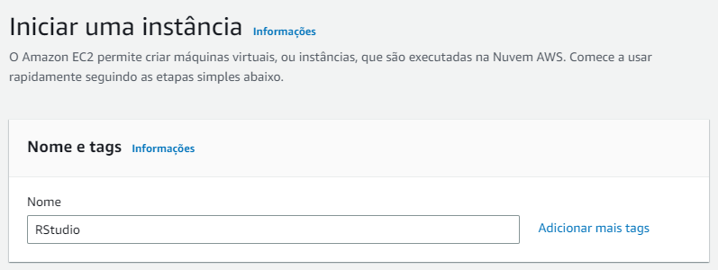
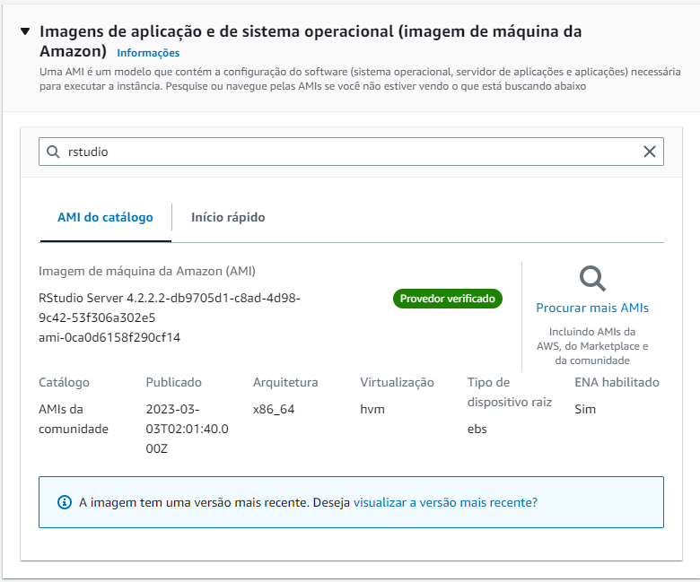
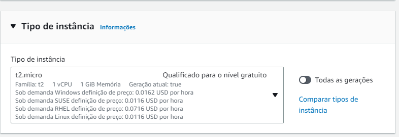

# Tutorial AWS EC2 Rstudio

<ol style="font-size:18px" >
    <li >
        Console Aws
     </li>
    <li>
        Pesquisar por EC2
    </li>
    <li>
        Iniciar instância 
        
    </li>
    <li>
        Buscar imagem do R-Studio
        

            
        

    </li>
    <li >
        Instância de nível gratuito
        

            
        

    </li>
    <li> Executar instância </li>
</ol>